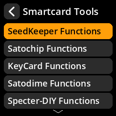
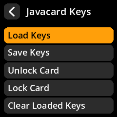

# Bundled JavaCard Applets

This fork ships a set of pre-built JavaCard applets and can build more from source.
This page explains **what each applet is and does**, and **which one to install**.

If you are looking at the **Install Applet** list on the device and wondering which
file to pick, jump to [Which applet should I install?](#which-applet-should-i-install).

> **Official Satochip documentation:** for the vendor's own guides to the Satochip,
> SeedKeeper and Satodime ecosystems, see the
> [Satochip quick-start documentation](https://satochip.io/quick-start/). This page
> covers how the applets are used *from SeedSigner*.

## Where the applets come from

The files live in the repository's [`javacard-cap/`](https://github.com/3rdIteration/seedsigner/tree/dev/javacard-cap) directory and are
copied onto the SeedSigner OS image. On the device they appear under
**Tools → Smartcard Tools → DIY Tools → Install Applet** and can be flashed straight to
a blank JavaCard.

`javacard-cap/javacard-cap.sha256` pins each file by SHA-256. A test
(`tests/test_javacard_cap_manifest.py`) verifies the manifest on every ordinary test
run, so a corrupted or substituted CAP is caught before it can be flashed.

## The applets

| CAP file | Applet | What it is for | Menu |
|---|---|---|---|
| `SeedKeeper-0.2-official.cap` | **SeedKeeper** v0.2 | PIN-protected storage for BIP-39 seeds, passphrases, multisig descriptors, generic secrets and GPG/BIP85 data | Tools → Smartcard Tools → SeedKeeper Functions |
| `SeedKeeper-Ndef-v0.2-0.1.cap` | **SeedKeeper + NDEF** | The same SeedKeeper applet **plus** a small companion NDEF applet, so the card can answer NFC tag reads and carry a "tap to open" record for the Seedkeeper phone app | Tools → Smartcard Tools → SeedKeeper Functions |
| `SatoChip-0.12-official.cap` | **Satochip** v0.12 | A seed-bearing signing card: store a seed, export xpubs, verify/sign PSBTs and messages on-card, 2FA | Tools → Smartcard Tools → Satochip Functions |
| `SatoDime-0.1.2-official.cap` | **Satodime** v0.1.2 | A *bearer* card: pre-generated key slots you can seal/unseal and spend, with no PIN | Tools → Smartcard Tools → Satodime Functions |
| `Keycard_v3.2.cap` | **Keycard** v3.2 | Status Keycard applet: store a seed, export xpubs, sign PSBTs; PIN/PUK management and optional duress PIN | Tools → Smartcard Tools → KeyCard Functions |
| `SpecterDIY.cap` | **Specter-DIY** MemoryCard | A simple secure-element store for one BIP-39 mnemonic, with a card PIN | Tools → Smartcard Tools → Specter-DIY Functions |
| `SmartPGP-RSA2048.cap` | **SmartPGP** (RSA-2048) | Open-source OpenPGP smart card applet ([github-af/SmartPGP](https://github.com/github-af/SmartPGP)); installed with a random serial; used by the GPG Tools' SmartGPG flows | GPG Tools → SmartGPG |
| `SmartPGP-RSA4096.cap` | **SmartPGP** (RSA-4096) | As above, built for RSA-4096 keys | GPG Tools → SmartGPG |
| `Vivokey-OTP.cap` | **VivoKey OTP** | YubiKey-compatible TOTP authenticator — turns the card into a hardware one-time-password token you can use anywhere a YubiKey OTP/TOTP is accepted (see [VivoKey/OTPAuthenticator](https://github.com/VivoKey/OTPAuthenticator)) | — (install only) |

> A **legacy SeedKeeper v0.1** CAP also exists, but only as a hardware-test fixture
> under [`tests/javacard-cap-legacy/`](https://github.com/3rdIteration/seedsigner/blob/dev/tests/javacard-cap-legacy/README.md). It is
> deliberately **not** offered in the on-device installer. See
> [SeedKeeper v0.1](#seedkeeper-v01-legacy) below.

## Which applet should I install?

The device's menu is the quickest guide. Your choices depend on what you want to do:

### I want to store seeds / passphrases / descriptors on a card — SeedKeeper

Install **`SeedKeeper-0.2-official.cap`**.

- `SeedKeeper-0.2-official.cap` contains the standard `536565644B6565706572` package only.
- `SeedKeeper-Ndef-v0.2-0.1.cap` contains the **same** SeedKeeper applet **plus** a
  companion NDEF applet (`...01`). It is otherwise identical and stores secrets the same
  way.

Pick the **NDEF** build only if you want the card to behave as an NFC tag. In practice
that means: tapping the card on an Android phone can pop up the Seedkeeper mobile app
(the card carries an "Android App Launch" NDEF record for `org.satochip.seedkeeper`), or
you want to read/write arbitrary NDEF payloads from SeedSigner's
**Configure NDEF** menu. If you never tap the card on a phone and only use it with
SeedSigner, the plain build is enough.

Both builds are fully usable by SeedSigner. The on-device **Configure NDEF** and
**Use Seedkeeper App Link** options in the SeedKeeper card settings only do something
useful on the NDEF build.

> **DIY shortcut:** in the Install Applet list, choose **8 KB** storage unless you have
> a reason not to. It is the default and is enough for a handful of seeds, passphrases
> and descriptors.

### I want a card that signs transactions itself — Satochip

Install **`SatoChip-0.12-official.cap`**. This is a full signing card. You can import a
seed, export xpubs for a watch-only wallet, and have the card verify and sign PSBTs
(and messages) directly. See [Satochip](./satochip.md).

### I want a bearer card — Satodime

Install **`SatoDime-0.1.2-official.cap`**. A Satodime has key slots whose private keys
the card generated and never reveals until you *unseal* a slot. It has **no PIN**.
See [Satodime](./satodime.md).

### I want to use a Status Keycard — Keycard

Install **`Keycard_v3.2.cap`**, then enable **KeyCard support** in
Settings → Advanced. See [Keycard](./keycard.md).

### I want a simple mnemonic card — Specter-DIY

Install **`SpecterDIY.cap`**, then enable **Specter-DIY support** in
Settings → Advanced. See [Specter-DIY](./specter_diy.md).

### I want an OpenPGP card — SmartPGP

Install **`SmartPGP-RSA2048.cap`** or **`SmartPGP-RSA4096.cap`**. [SmartPGP](https://github.com/github-af/SmartPGP)
is an open-source OpenPGP smart card applet for JavaCard. It implements the OpenPGP
card specification, so you can use the card for GPG key storage, encryption, signing
and authentication with any OpenPGP-compatible software, and it supports RSA as well as
elliptic-curve (ECC) keys — the two bundled CAPs differ only in the key sizes they are
built for.

SeedSigner generates a random 4-byte serial and embeds it in the AID during installation, matching the
[flexsecure applet procedure](https://github.com/DangerousThings/flexsecure-applets/blob/master/docs/applets/1-pgp.md).
See [GPG Tools](./gpg_tools.md), including the **SmartGPG** menu for on-card key
generation and PIN management.

### I want YubiKey-compatible TOTP — VivoKey OTP

Install **`Vivokey-OTP.cap`**. The [VivoKey OTPAuthenticator](https://github.com/VivoKey/OTPAuthenticator)
applet makes the JavaCard behave like a YubiKey for one-time passwords, so the same card
you keep seeds on can also act as a hardware authenticator. SeedSigner installs and
uninstalls it like any other applet; the TOTP secrets are managed with VivoKey tooling,
not from SeedSigner's menus.

## Installing an applet



1. Go to **Tools → Smartcard Tools → DIY Tools**.
2. Choose **Install Applet**.
3. Select the `.cap` file. Files from the repository come first, followed by any `.cap`
   files in `javacard-cap/` on the MicroSD card (labelled **Internal** / **MicroSD** so
   you can tell them apart).
4. For **SeedKeeper**, choose a storage size:

   | Button | Install parameter |
   |---|---|
   | 4 KB | `0FFF` |
   | **8 KB (default)** | `1FFF` |
   | 16 KB | `3FFF` |
   | 32 KB | `7FFF` |
   | 64 KB | `FFFF` |

5. For **SmartPGP**, SeedSigner generates a random serial number automatically.
6. Wait for the success screen.


### Requirements

- A blank (or previously wiped) JavaCard. The J3H145 cards sold for Satochip/SeedKeeper
  use are typical.
- A smart card reader. On a contactless/NFC reader, applet *installation* can be less
  reliable than on a contact reader; if an install fails, try a USB contact reader.
- Installation uses the bundled `pygp` module — you do **not** need `gp.jar` or a
  separate GlobalPlatform install.

### Uninstalling

**DIY Tools → Uninstall Applet** lists the applets currently on the card, using friendly
names (SeedKeeper, Satochip, Satodime, Keycard, SmartPGP, SpecterDIY, …). Uninstalling
erases the applet's data and cannot be undone.



## Build applets from source (optional)

**DIY Tools → Build Applets** compiles the Satochip/SeedKeeper/Satodime applets from
source and writes the resulting `.cap` files into `javacard-cap/` on the MicroSD card,
where **Install Applet** can then flash them.

- The ANT build file is generated from trusted, hard-coded toolchain paths inside
  SeedSigner. A `javacard-build.xml` on the MicroSD is **never executed** — ANT build
  files are arbitrary code and would be a security risk.
- To customise the build, place a strictly-validated `javacard-build.json` at the root
  of the MicroSD:

  ```json
  {
    "applets": ["satochip", "seedkeeper", "satodime",
                "satochip-thd89", "seedkeeper-thd89", "satodime-thd89"],
    "overrides": {
      "seedkeeper": { "aid": "536565644B6565706572", "version": "0.2" }
    }
  }
  ```

  Only `applets` (a list of known names) and per-applet `aid` (32 hex chars) / `version`
  (`N.N`) are honoured. Unknown names are dropped; `sources`/`jckit` paths cannot be
  overridden.

- Buildable variants include **THD89** versions for that secure element. The output CAPs
  are named e.g. `SeedKeeper-built-0.2.cap`, `SatoChip-built-0.12.cap`,
  `SatoDime-built-0.1.2.cap`.

The source is expected in a `Satochip-DIY` checkout at `/mnt/diy/Satochip-DIY` (SeedSigner
OS) or `/home/pi/Satochip-DIY` (a development board). See
[Smartcard installation](./smartcard_support_installation.md) for build prerequisites.

## JavaCard keys (GlobalPlatform)

**DIY Tools → Card Keys** manages the GlobalPlatform keys used to install/
uninstall applets:

- **Load Keys / Save Keys** — read/write `javacard-keys.txt` at the card root, or store
  the same plaintext format on a SeedKeeper (entries are labelled with the `jc_keys`
  prefix).
- **Generate Single Key / Key Set** — generate random ENC/MAC/DEK keys on the device.
- **Unlock Card** — reset the card to the **default development keys**
  (`404142434445464748494A4B4C4D4E4F`). Use with care.
- **Lock Card** — set the card's keys to the loaded ENC/MAC/DEK set. Save the keys first.
- **Clear Loaded Keys** — forget the keys currently held in memory.

> If you lock a card with custom keys and lose them, you can no longer install or
> uninstall applets on it.

## SeedKeeper v0.1 (legacy)

SeedKeeper **v0.1** is superseded and is not shipped in `javacard-cap/`. It is worth
knowing about because a card flashed with it behaves differently:

- It hard-codes a **4 KB** object memory and **ignores** the install parameters, so
  choosing 8/16/32/64 KB has no effect.
- It **cannot delete secrets** (`RESET_SECRET` throws `0x9C05`), so once full it can only
  be recovered by a factory reset or re-flash.
- Both v0.1 and v0.2 report *applet* version 0.1; the discriminator is the **protocol**
  minor version (v0.1 → 1, v0.2 → 2).

If an import fails with `SW_NO_MEMORY_LEFT` (0x9C01) on a card that seems to have room,
you are likely on a v0.1 applet. SeedSigner's error message tells you the correct
recovery for the version it detects. Re-flashing
`SeedKeeper-0.2-official.cap` (or the NDEF build) fixes it.

See [`tests/javacard-cap-legacy/README.md`](https://github.com/3rdIteration/seedsigner/blob/dev/tests/javacard-cap-legacy/README.md) for
the full behavioural comparison.

## Testing build: quick applet flashing

Developer/testing builds (`SEEDSIGNER_TESTING_BUILD=1`) add a **Flash Applet** button to
the Home screen that jumps straight to the Install Applet picker, so you can flash a
card without navigating the Tools menus.

## Related

- [Smartcard integration and installation](./smartcard_support_installation.md)
- [SeedKeeper guide](./seedkeeper.md)
- [Satochip guide](./satochip.md)
- [Keycard guide](./keycard.md)
- [Specter-DIY guide](./specter_diy.md)
- [Satodime guide](./satodime.md)
