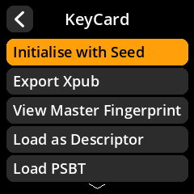
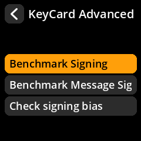

# Keycard

A **Status Keycard** is a JavaCard that stores a seed and signs like a Satochip. This
fork supports it through a compatibility backend, so most Satochip-style flows work on
a Keycard.

See also: [Bundled JavaCard Applets](./javacard_applets.md) and the Keycard notes in
[Smartcard integration and installation](./smartcard_support_installation.md).

## Requirements and setup

- The **Keycard applet** flashed to a JavaCard (`Keycard_v3.2.cap`).
- **Smartcard support** and **KeyCard support** enabled in Settings → Advanced.
  **KeyCard support is disabled by default** — turn it on before the menu appears.
- The `keycard-cli` Python compatibility layer installed. If it is not in the active
  environment, point SeedSigner at a checkout:

  ```bash
  export SEEDSIGNER_KEYCARD_CLI_PATH=/home/pi/keycard-cli/python
  # or: export SEEDSIGNER_KEYCARD_PY_PATH=...
  ```

- For a card with a custom pairing password:

  ```bash
  export SEEDSIGNER_KEYCARD_PAIRING_PASSWORD='your-pairing-password'
  ```

  The Keycard menu forces the **keycard** backend (no auto-detection), while generic
  Satochip flows may fall back between backends. Override with
  `SEEDSIGNER_SMARTCARD_BACKEND=pysatochip|keycard|auto`.

- Keycard PINs are **6 digits**.

## The KeyCard menu

**Tools → Smartcard Tools → KeyCard Functions**



| Menu item | What it does |
|---|---|
| **Initialise with Seed** | Initialise a blank card and write a seed |
| **Export Xpub** | Export single-sig / multisig xpubs |
| **View Master Fingerprint** | Show the card's master fingerprint |
| **Load as Descriptor** | Build a single-sig descriptor and open the Address Explorer |
| **Load PSBT** | Verify and sign a transaction |
| **Change PIN** | Set a new 6-digit PIN |
| **Set PUK** | Set the PIN-unblock key |
| **Unblock PIN with PUK** | Reset a blocked PIN using the PUK |
| **Set Name** | Give the card a friendly name |
| **Remove Seed** | Delete the seed from the card |
| **Factory Reset Card** | Wipe the card |
| **Advanced** | Benchmarks and signing-bias check |



## Initialising a Keycard

1. Have the seed loaded in SeedSigner.
2. **KeyCard Functions → Initialise with Seed**.
3. A blank card is initialised in-app: set a **New Card PIN** (6 digits, entered twice).
4. Optionally set a **Duress PIN**. Entering the duress PIN instead of the main PIN
   unlocks a **decoy wallet** with different keys. The applet only accepts a duress PIN
   during initialisation — it cannot be added or changed afterwards. If you skip it, the
   applet defaults it to the first half of a randomly generated, unrecorded PUK.
5. Choose the seed to import.

Once seeded, the same export/sign/descriptor flows as Satochip are available.

## Signing and xpub export

`Export Xpub`, `Load as Descriptor` and `Load PSBT` behave like their
[Satochip counterparts](./satochip.md#exporting-xpubs): choose sig type, script type and
(when enabled) BIP32 account, then scan the resulting QR into a watch-only wallet.

## PIN, PUK and card management

- **Change PIN** sets a new 6-digit PIN.
- **Set PUK** / **Unblock PIN with PUK** manage the unblock key. If the PIN is blocked
  after too many wrong attempts, use the PUK to unblock it (or reset the card).
- **Set Name** labels the card.
- **Remove Seed** deletes the seed; the card can then be re-seeded.
- **Factory Reset Card** wipes the card completely.

## Related

- [Satochip](./satochip.md)
- [Install applets on DIY JavaCards](./javacard_applets.md)
