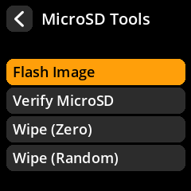

# MicroSD Tools

**Tools → MicroSD Tools** bundles utilities for preparing and maintaining the MicroSD
card, so you do not need a computer for common tasks.

| Menu item | What it does |
|---|---|
| **Flash Image** | Write a bundled SeedSigner image to a MicroSD card |
| **Verify MicroSD** | Verify a freshly flashed card against a known image |
| **Wipe (Zero)** | Overwrite the card with zeros |
| **Wipe (Random)** | Overwrite the card with random data |

> **These tools are only available on the device.** In desktop simulation mode the menu
> reports that the tools are unavailable, because there is no Raspberry Pi SD interface
> to drive.

## Flash Image

**Flash Image** writes one of the official SeedSigner images bundled with the OS to
another MicroSD card. Choose the image from the list and confirm. This is the in-app
equivalent of Etcher / Raspberry Pi Imager.

The device must have the source images available (they ship with SeedSigner OS) and a
target card inserted. Flashing overwrites the target card completely.

## Verify MicroSD

**Verify MicroSD** compares the contents of a freshly flashed card against the known
bundled image, so you can confirm a flash succeeded without a computer. It is intended
to be run on a card you are holding aside, before trusting it.

## Wipe

The two wipe options overwrite the card with zeros or with random data. For each you
choose how much to write:

- **64 MB** – enough to overwrite the metadata/partition table on most cards.
- **256 MB** – a deeper wipe.
- **All** – overwrite the whole card (slow).

Secure erasure is about removing data you no longer want recoverable. **Wipe (Random)**
is the stronger option; **Wipe (Zero)** is faster. Neither can recover a card that has
already failed.

> SeedSigner is stateless and never writes seeds to the MicroSD card, so a normal card
> does not contain secret material. Use these tools when recycling or disposing of a
> card, or when preparing one for a fresh image.

## Related

- [Seed QR formats](./seed_qr/README.md)
- [Repositories and release pairing](./repositories.md)
