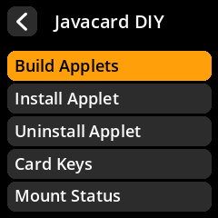

# Quick start 01 — Install applets on DIY JavaCards

This guide takes a blank JavaCard (for example a J3H145) and flashes the **SeedKeeper**
applet so SeedSigner can store seeds on it. The same steps install Satochip, Satodime,
Keycard, Specter-DIY and SmartPGP — only the `.cap` file changes.

> Read [Bundled JavaCard Applets](../javacard_applets.md) first if you are unsure which
> applet to install. For SeedKeeper you almost certainly want
> `SeedKeeper-0.2-official.cap` (plain) or `SeedKeeper-Ndef-v0.2-0.1.cap` (adds NFC tag
> behaviour).

## What you need

- A blank or wiped JavaCard.
- A smart card reader connected to SeedSigner. A **USB contact reader** is the most
  reliable choice for flashing; NFC/contactless flashing can be less reliable.
- **Smartcard support** enabled (Settings → Advanced; enabled by default).

## Steps

1. Put the card on the reader.
2. Go to **Tools → Smartcard Tools → DIY Tools**.

   

3. Choose **Install Applet**.
4. Pick the applet:

   - **SeedKeeper-0.2-official.cap** — normal SeedKeeper.
   - **SeedKeeper-Ndef-v0.2-0.1.cap** — SeedKeeper **plus** NDEF (tap-to-open-app).

5. If you picked a SeedKeeper build, choose the storage size. **8 KB** is the default
   and is plenty for most users:

   | Size | Notes |
   |---|---|
   | 4 KB | Only if you must; very few secrets |
   | **8 KB** | Recommended default |
   | 16 / 32 / 64 KB | For many seeds/descriptors |

6. Wait for the success screen. The card now has the applet.

## Verify the applet

1. Go to **Tools → Smartcard Tools → SeedKeeper Functions → Card Settings → Card Info**.

   

2. Confirm the **Type** is `SeedKeeper` and the **Version** is `0.2-0.1`.

   > Both applet v0.1 and v0.2 report applet version 0.1. The **protocol** minor version
   > is the real discriminator (v0.1 → `0.1`, v0.2 → `0.2`). If you see `0.1`, you
   > flashed the legacy v0.1 build.

## First use: set a PIN

The first SeedKeeper operation asks you to set a **New Card PIN** (entered twice). Keep
it safe — there is no PIN recovery.

## If something goes wrong

- **"No smartcard detected"** — re-seat the card, check the reader, or try the other
  reader type. On NFC, move the card slower/closer.
- **Install fails on a contactless reader** — try a USB contact reader.
- **You locked the card with custom GlobalPlatform keys** — see
  [Quick start 06 — First-time DIY card setup](./06-diy-card-first-time.md).
- **A full SeedKeeper v0.1 cannot be freed by deleting secrets** — re-flash the v0.2
  applet. See [SeedKeeper v0.1](../javacard_applets.md#seedkeeper-v01-legacy).

## Related

- [Bundled JavaCard applets](../javacard_applets.md)
- [Quick start 02 — Mnemonic to a SeedKeeper](./02-mnemonic-seedkeeper.md)
