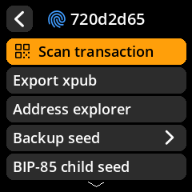
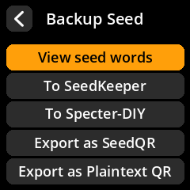
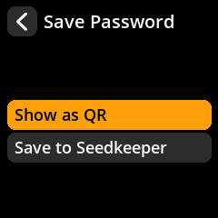
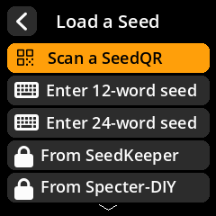

# Quick start 02 — Generate a mnemonic and save it to a SeedKeeper

This guide creates a new BIP-39 seed on the SeedSigner, saves it to a SeedKeeper card,
and loads it back.

## What you need

- A SeedKeeper card with the applet installed and a PIN set
  ([Quick start 01](./01-install-applets-diy-javacard.md)).
- The seed you generate will be on the card. Depending on how you generate it, the
  SeedSigner is stateless — **the card may be your only copy**, so treat it accordingly.

## Part 1 — Create a seed

1. From Home choose **Tools**.
2. Choose **New seed** (camera entropy) or **New seed** (dice entropy).

   

3. Choose the mnemonic length (12/15/18/21/24 words).
4. Generate entropy (photograph a varied scene for the camera, or enter dice rolls).
5. SeedSigner shows the words. Write them down / verify them, then finalize the seed.

   

## Part 2 — Save the seed to the SeedKeeper

1. On the **Seed Options** screen choose **Backup seed**.

   

2. Choose **To SeedKeeper**.
3. Enter the card PIN if prompted (or set one if the card is blank).
4. Enter a **Seed Label** — the default is the fingerprint; a friendly name like
   `savings` is easier to spot later.

   

5. Wait for **Secret Saved**.

   

The seed (master seed, wordlist and passphrase) is now on the card. You can optionally
repeat on a second card for redundancy.

## Part 3 — Load the seed back

1. **Seeds → Load a seed → From SeedKeeper**.

   

2. Enter the card PIN if prompted.
3. Pick the secret from the **Select Secret** list.

   

4. The seed loads into memory. Check the fingerprint matches the seed you saved.

## Optional — verify the card's contents

**Tools → Smartcard Tools → SeedKeeper Functions → View Free Space** or
**View Secrets on Card** to confirm the secret was written.

## Related

- [SeedKeeper](../seedkeeper.md)
- [Bundled JavaCard applets](../javacard_applets.md)
- [Quick start 09 — SeedQR backup](./09-seedqr-backup.md)
