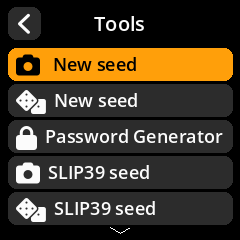
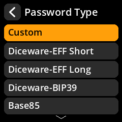
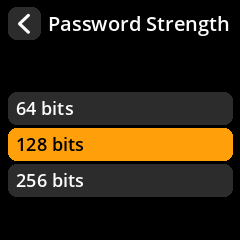
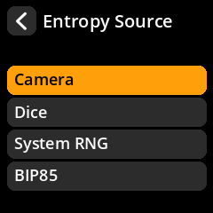
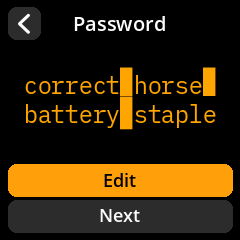
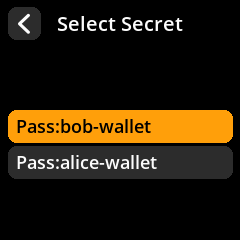

# Quick start 05 — Generate a password and save it to a SeedKeeper

This guide generates a strong password with the Password Generator, then stores it on a
SeedKeeper card so you can read it back later.

## What you need

- A SeedKeeper card with a PIN set ([Quick start 01](./01-install-applets-diy-javacard.md)).
- **Tools → Password Generator** is available on any build; no special settings.

## Part 1 — Generate the password

1. Go to **Tools → Password Generator**.

   

2. Choose a **Password Type**.

   

   For a passphrase you can retype, **Diceware-BIP39** is a good default; for a random
   string, choose **Base64** or **Custom**.

3. Choose a **strength** (64 / 128 / 256 bits) and, for word-based types, a **separator**.

   

4. Choose an **entropy source**.

   

   - **System RNG** is fastest. If the device's RNG monitor has flagged the source as
     unhealthy, generation fails closed with a **System RNG Error** rather than making a
     weak password.
   - **Camera** samples noise from the camera; move it over a varied scene.
   - **Dice** asks you to enter rolls.
   - **BIP85** derives it deterministically from a loaded seed.

5. Review the generated password. It is shown on screen; if you chose a QR-friendly
   option you can also **Show as QR**.

   

## Part 2 — Save it to the SeedKeeper

1. On the review/save screen, choose **Save to Seedkeeper**.

   

2. Enter a **Password Name** (the label, e.g. `exchange-login`).
3. Wait for **Password saved to Seedkeeper**.

## Part 3 — Read it back

1. **Tools → Smartcard Tools → SeedKeeper Functions → View Secrets on Card**.
2. Choose the password's label.
3. View it as text, or show it as a QR code.

   

## Important

A password stored only on a card is lost if the card is lost. Keep a separate recovery
copy of anything critical. The SeedKeeper is a convenience, not a backup strategy on its
own.

## Related

- [Password Generator](../password_generator.md)
- [SeedKeeper](../seedkeeper.md)
- [Quick start 02 — Mnemonic to a SeedKeeper](./02-mnemonic-seedkeeper.md)
