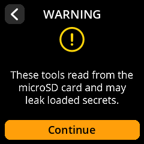
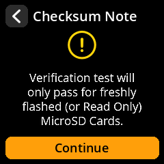
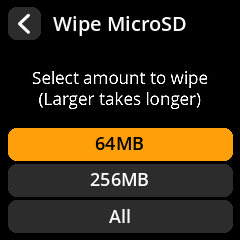

# Quick start 10 — Flash a MicroSD card

**Tools → MicroSD Tools** can write a bundled SeedSigner image to a MicroSD card and
verify it, without a computer.

> On many boards SeedSigner itself runs from MicroSD, so you need a way to attach the
> **target** card while the device is running. Where that is not possible, use Balena
> Etcher or Raspberry Pi Imager on a computer instead. In desktop simulation mode the
> MicroSD tools are unavailable.

## Flash an image

1. Go to **Tools → MicroSD Tools → Flash Image**.

   

2. Choose the image to write (the official images bundled with SeedSigner OS are
   listed).
3. Choose the target card.
4. Confirm and wait for the write to finish. Flashing **overwrites the target card
   completely**.

## Verify a freshly flashed card

1. **Tools → MicroSD Tools → Verify MicroSD**.
2. Read the warning and continue.

   

3. SeedSigner compares the card against the known image and reports whether it matches.

## Wipe a card

To erase a card before recycling it:

- **Wipe (Zero)** — overwrite with zeros.

  

- **Wipe (Random)** — overwrite with random data (stronger).

  

Choose how much to write: **64 MB**, **256 MB**, or **All**.

## Related

- [MicroSD Tools](../microsd_tools.md)
- [Repositories and release pairing](../repositories.md)
- [Verifying your download](../README.md)
