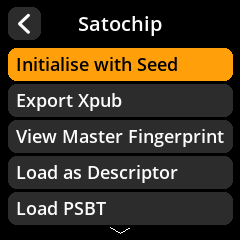
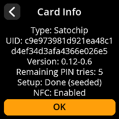
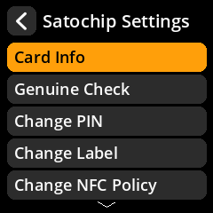
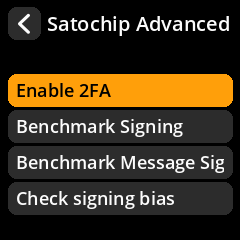

# Satochip

A **Satochip** is a seed-bearing signing JavaCard. Unlike a SeedKeeper, which only
stores secrets, a Satochip holds a BIP-32 seed and can derive keys and sign
transactions and messages *on the card*. SeedSigner uses it as an extra signing device
alongside the in-memory seed flows.

See also: [Bundled JavaCard Applets](./javacard_applets.md) and
[Smartcard integration and installation](./smartcard_support_installation.md).

> **Official Satochip documentation** — [satochip.io/quick-start](https://satochip.io/quick-start/)

## Requirements and setup

- The **Satochip applet** flashed to a JavaCard
  (`SatoChip-0.12-official.cap`).
- **Smartcard support** and **Satochip support** enabled (both default **Enabled**) in
  Settings → Advanced.
- A supported reader.

## The Satochip menu

**Tools → Smartcard Tools → Satochip Functions**

| Menu item | What it does |
|---|---|
| **Initialise with Seed** | Write a seed to the card (one time only) |
| **Export Xpub** | Export single-sig or multisig xpubs for a watch-only wallet |
| **View Master Fingerprint** | Show the card's master key fingerprint |
| **Load as Descriptor** | Build a single-sig descriptor from the card and use it in the Address Explorer |
| **Load PSBT** | Verify and sign a transaction with the card |
| **Card Settings** | Info, genuine check, PIN, label, NFC policy, factory reset |
| **Advanced** | 2FA, benchmarks, signing-bias check |

## Initialising a Satochip with a seed

A Satochip can be seeded **once**. Seeding an already-seeded card fails; reset the card
first if you need to change the seed.

1. Have the seed loaded in SeedSigner (create one, scan a SeedQR, load from SeedKeeper,
   enter words, or recreate from SLIP-39).
2. **Tools → Smartcard Tools → Satochip Functions → Initialise with Seed**.
3. Continue past any **Already Seeded** warning (the card must be blank).
4. Choose the seed from the **Seed to Import** list (loaded seeds appear at the top,
   fingerprinted; you can also scan or type a new one here).
5. SeedSigner writes the seed to the card and shows **Seed Imported**.

The card is now seeded. `View Master Fingerprint` should match the seed's fingerprint.

> The card PIN is set the first time you use the card (a blank Satochip prompts for a
> **New Card PIN**). See [Satochip card settings](#card-settings).

## Exporting xpubs

Use **Export Xpub** to add the Satochip to a watch-only wallet.

1. **Satochip Functions → Export Xpub**.
2. Choose **Single Sig** or **Multisig**.
3. Choose the script type (Native Segwit, Nested Segwit, Taproot, Legacy — depending on
   your **Script types** setting and the card's capabilities).
4. If **BIP32 account prompt** is enabled, choose the account number.
5. Choose the coordinator / QR format, confirm the warning, and review the derivation
   details.
6. The xpub is displayed as a QR code to scan into your wallet.

The derivation details screen lets you verify the path before exporting.

## Using the card as a single-sig descriptor

**Load as Descriptor** builds a single-sig descriptor from the card's master key. After
choosing the script type (and derivation, if prompted), you land on the descriptor
summary and can open the **Address explorer** — useful for verifying receive addresses
against a wallet that watches the same key.

## Signing a transaction with the card

1. Scan a PSBT as normal (from a watch-only wallet that knows the card's xpub).
2. **Satochip Functions → Load PSBT**.
3. Confirm the card is seeded and select the derivation.
4. SeedSigner sends the transaction to the card for verification and signing.

The Satochip verifies the transaction on-card before signing. The signed result is
returned as a PSBT QR to scan back into your wallet.

Message signing (proving address ownership) is available from
**Seeds → seed → Sign message** with the Satochip selected as the signer.

### Signing timeouts

Satochip signing is slow and deliberately randomised with dummy operations (see
below). If signing times out on a slow device, increase
Settings → Advanced → **Satochip tx sign timeout** / **Satochip message sign timeout**.

## Card settings

**Satochip Functions → Card Settings**

| Item | Purpose |
|---|---|
| **Card Info** | Card type, UID, versions, PIN tries, seed state, NFC policy |
| **Genuine Check** | Verify the card is genuine |
| **Change PIN** | Set a new card PIN |
| **Change Label** | Give the card a friendly name |
| **Change NFC Policy** | Enable / Disable / Block contactless |
| **Factory Reset Card** | Wipe the card (supported on Satochip v0.12-0.4 and later) |

## Advanced

### Enable 2FA

**Enable 2FA** requires a one-time password (HMAC) alongside the PIN for signing. You
can set an amount limit (in satoshis) above which 2FA is required. The 2FA secret is
shown for you to record; if you lose it you cannot sign above the limit.

### Benchmarks

**Benchmark Signing** and **Benchmark Message Signing** run repeated operations and
report minimum/average/maximum timing. Useful for tuning the signing timeouts on a
particular device or card.

### Check signing bias

Satochip's dummy-transaction signing (below) can be checked for bias in the resulting
signatures with **Check signing bias**.

## Dummy signing and timing (why signing is slow)

To make side-channel attacks harder, SeedSigner mixes **randomised dummy signing
requests** into real ones. Several settings control this in
Settings → Advanced:

- **Satochip pre-sign dummies** (0–12, default 6)
- **Satochip post-sign dummies** (0–12, default 6)
- **Satochip in-tx dummies** (1–5, default 3)
- **Satochip dummy probability** (0–100 %, default 50 %)

Dummy operations carry no information about your transaction, so more dummies means
slower signing but a less useful timing signal for an attacker. The defaults are a
reasonable balance; the settings exist so you can trade speed against hardening.

## Related

- [Install applets on DIY JavaCards](./javacard_applets.md)
- [Keycard](./keycard.md)
- [Multisig descriptors](./multisig_descriptors.md)
- [Quick start: initialise a Satochip with a seed](./quickstarts/04-satochip-init-with-seed.md)
