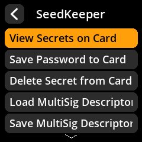
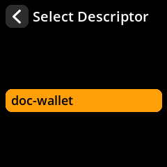
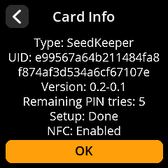
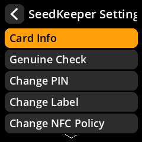
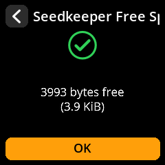

# SeedKeeper

A **SeedKeeper** is a PIN-protected JavaCard that stores secrets for you. SeedSigner can
use it to save and load BIP-39 seeds (with or without their passphrase), individual
passphrases, multisig descriptors, generic secrets (passwords, notes, GPG/BIP85 data)
and SLIP-39 shares.

Unlike a SeedQR, the card is protected by a PIN and a secure channel, so a lost card is
not immediately a lost seed. Unlike the SeedSigner itself, the card remembers things
between power cycles.

> A SeedKeeper is a *storage* device. SeedSigner still does the deriving and signing.
> The card's job is to keep secrets at rest.

See also: [Bundled JavaCard Applets](./javacard_applets.md) for installing the applet
and choosing the plain vs NDEF build, and
[Smartcard integration and installation](./smartcard_support_installation.md) for
readers and wiring.

> **Official Satochip / SeedKeeper documentation** —
> [satochip.io/quick-start](https://satochip.io/quick-start/). Satochip also publishes a
> standalone Seedkeeper app for reading a card without SeedSigner.

## Requirements and setup

- The **SeedKeeper applet** flashed to a JavaCard (see
  [Install Applet](./javacard_applets.md#installing-an-applet)).
- **Smartcard support** enabled (default **Enabled**) in
  Settings → Advanced → Smartcard support.
- A supported reader: USB PC/SC, PN532 NFC, SEC1210 hat, or a Phoenix "sim reader".

### First use: set a PIN

A blank SeedKeeper has no PIN. The first SeedKeeper operation shows a
**Card Uninitialised** warning and asks you to set a **New Card PIN** (entered twice).
This is the PIN the card will require from then on. Keep it safe: there is no PIN
recovery.

If you set **Cache Smartcard Pin** (Settings → General), SeedSigner remembers the PIN
for the current session so you are not asked on every operation. The setting is off by
default and the cached PIN is cleared when the device restarts or the card changes.

## The SeedKeeper menu

**Tools → Smartcard Tools → SeedKeeper Functions**

| Menu item | What it does |
|---|---|
| **View Secrets on Card** | List every secret stored on the card |
| **Save Password to Card** | Store a free-form secret (password or note) |
| **Delete Secret from Card** | Delete a stored secret (not supported on v0.1 cards) |
| **Load MultiSig Descriptor** | Load a descriptor stored on the card |
| **Save MultiSig Descriptor** | Store the currently loaded descriptor |
| **Clone Card Secrets** | Copy secrets from one SeedKeeper to another |
| **View Free Space** | Show used/free bytes and secret count |
| **Card Settings** | Card info, PIN, label, NFC policy, NDEF, factory reset |

## Saving and loading a seed

### Save a seed to a SeedKeeper

1. Load or create the seed in SeedSigner (**Seeds → Load a seed**).
2. On the seed's **Seed Options** screen, choose **Backup seed**.
3. Choose **To SeedKeeper**.
4. Enter a **Seed Label** (or accept the fingerprint-based default).
5. The seed is written to the card and a **Secret Saved** screen appears.

For a **BIP-39 seed**, SeedSigner stores the master seed, the wordlist and the
passphrase together, so a later load restores the exact same wallet (including the
passphrase).

For a **SLIP-39 seed** you choose which share to store.

### Load a seed from a SeedKeeper

1. **Seeds → Load a seed → From SeedKeeper**.
2. Enter the card PIN if prompted.
3. Pick the secret from the **Select Secret** list.

The seed is loaded into memory as if you had typed it, and its fingerprint is shown.

### Loading just a passphrase

SeedSigner also supports storing and loading a **passphrase on its own**, which lets a
seed and its passphrase live on separate cards (or one card and one SeedQR). When the
passphrase entry screen is shown, choose the **Load from SeedKeeper** option to fetch a
passphrase from the card, or use the **Save Password to Card** menu item to store one.

## Saving and loading a multisig descriptor

Descriptors are how a watch-only wallet tells SeedSigner about a multisig wallet.

### Save a descriptor

1. Load the descriptor (scan it, or load it from a card – see
   [Multisig descriptors](./multisig_descriptors.md)).
2. **Tools → Smartcard Tools → SeedKeeper Functions → Save MultiSig Descriptor**.
3. Enter a **Descriptor Label**.
4. SeedSigner writes the descriptor to the card. On a **v0.2** card the whole descriptor
   is stored as one `Descriptor` secret. On a **v0.1** card it is split into an
   `msig_desc_…` template plus one `xpub_…` secret per key (v0.1 cannot store a full
   descriptor).

### Load a descriptor

1. **Tools → Smartcard Tools → SeedKeeper Functions → Load MultiSig Descriptor** (or
   the **Load SeedKeeper** option on the descriptor-load screen).
2. Pick the descriptor from the list.

The descriptor is loaded and you are taken to the descriptor summary screen, from which
you can open the **Address explorer**. See
[Multisig descriptors](./multisig_descriptors.md).

## Generic secrets (passwords and notes)

**Save Password to Card** stores any text secret under a label. You are asked for a
**Password Name** and the secret is written to the card. Stored secrets can be viewed
as text or shown as a QR code from **View Secrets on Card**.

SeedSigner itself uses this mechanism for several features, including GPG public/private
keys and BIP85 metadata.

## Card maintenance

**Card Settings** opens:

| Item | Purpose |
|---|---|
| **Card Info** | Card type, UID, applet/protocol version, PIN tries left, setup state, NFC policy |
| **Genuine Check** | Ask the card to prove it is a genuine Satochip/SeedKeeper |
| **Change PIN** | Set a new card PIN |
| **Change Label** | Give the card a friendly name |
| **Change NFC Policy** | Enable / Disable / Block the contactless interface |
| **Configure NDEF** | Read/write NFC NDEF records (NDEF applet required) |
| **Factory Reset Card** | Wipe the card back to a blank state |

### View Free Space

Shows how much of the card's object memory is in use. SeedSigner checks free space
before every import and refuses with a clear message rather than corrupting a write.

### Change Label

The label is shown by `Card Info` and helps you tell cards apart when you use several.
It is also used to identify a Satodime ownership-key backup, if you use that feature.

### Change NFC Policy

- **Enabled** – the card responds to contactless readers.
- **Disabled** – contactless is off.
- **Blocked** – contactless is permanently blocked; re-enabling requires a factory
  reset. You are warned before choosing this.

### Configure NDEF

Available when the card was flashed with the **SeedKeeper-Ndef** build. You can view
the current NDEF record, set SeedKeeper's own "Android App Launch" record
(**Use Seedkeeper App Link**), clear it, or write a custom Text/URI/Android/Hex record.
This is what makes tapping the card on a phone open the Seedkeeper mobile app.

### Factory Reset Card

Wipes all secrets and the PIN. **A factory reset without a working backup means
unrecoverable loss of funds.** The screen says so, deliberately.

## Clone Card Secrets

**Clone Card Secrets** copies secrets from one SeedKeeper to another. It is intended for
moving your secrets to a replacement card without retyping them. You will be prompted to
present the source and destination cards in turn.

## Capacity and failures

SeedKeeper capacity is chosen at install time (4/8/16/32/64 KB). Importing into a full
card fails with `SW_NO_MEMORY_LEFT` (0x9C01). On a **v0.2** card, delete a secret or
reset a slot to free space. On a **v0.1** card secrets cannot be deleted, so only a
factory reset or re-flash will recover it — SeedSigner detects the version and tells you
which is which.

## Related

- [Install applets on DIY JavaCards](./javacard_applets.md)
- [Multisig descriptors](./multisig_descriptors.md)
- [BIP85](./bip85.md), [SLIP-39](./slip39.md)
- [Quick start: save a mnemonic to a SeedKeeper](./quickstarts/02-mnemonic-seedkeeper.md)
- [Quick start: multisig descriptor to a SeedKeeper](./quickstarts/03-multisig-descriptor-seedkeeper.md)
- [Quick start: password generator to a SeedKeeper](./quickstarts/05-password-generator-seedkeeper.md)
