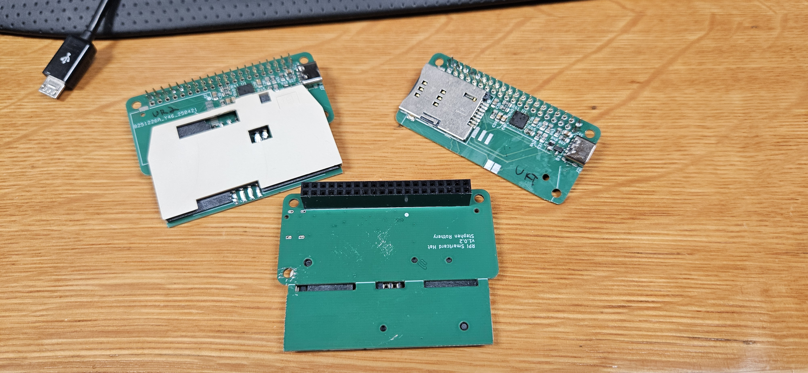
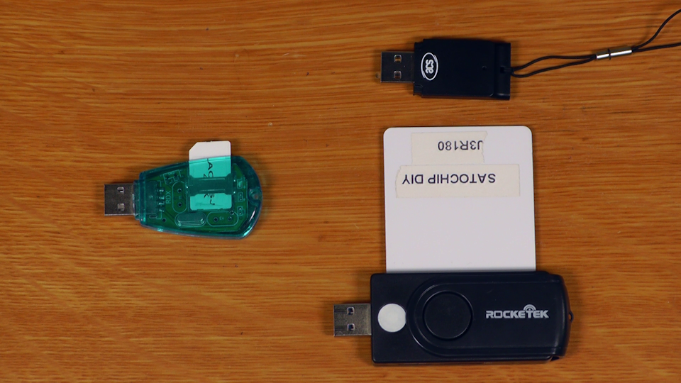
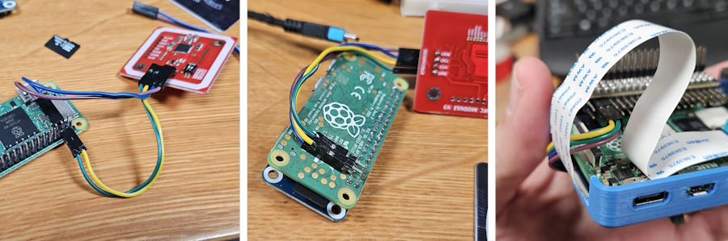

# Smartcard Seed Storage Support
## Background
Smart Cards are specifically designed to securely store digital data. Javacards are a type of Smart Cards that implement open standards development tools, making them ideal for DIY.

SeedKeeper is a open source seed storage product from Satochip which can be used to securely store multiple BIP39 seeds & passphrases. (And other types of secrets, but these aren't relevant to SeedSigner) In addition to providing the nessesary functionality, along with security features like secure-channel to protect the data exchange from eavesdropping, etc, the SeedKeeper also has standalone software available for users who may need to securely retrieve their data without access to a SeedSigner... 

This guide focuses on DIY SeedKeeper cards (which are the best for testing) but this will also work with retail SeedKeeper cards for those who prefer that simplicity...

Demo 1: Pi4 + NFC - https://youtu.be/WHVWqJJBNdA
Demo 2: PiZero 1.3 + NFC + USB Sim Reader (Phoenix) - https://youtu.be/uG44Fw3rOLg

## Hardware Requirements
### GPIO Connected Smartcard Hat

This SeedSigner fork now supports the SEC1210 Serial Smart Card reader, connected via GPIO. 



[The schematics and design files for these can be found in this repository](../electronics/SmartcardHat/)

[You can also buy these ready-made from my store](https://cryptoguide.tips/shop/)

You can also simply buy a SmartCard2Click board and connect it to the Raspberry Pi GPIO header.

### USB Smart Card Readers 
Any USB smart card reader that is compatible with will work, either hard-wired (Contact) or NFC (Contactless).



If you are running SeedSigner on a system image that is derived from a standard Raspberry Pi OS image, USB devices should be plug and play once PC/SC services are installed.

**Compatibility Notes**

The **ACS ACR 122U reader** is unreliable for flashing applets and may brick your card. (Though works fine for normal operation after they have been flashed)

### GPIO NFC Connected Smart Card Readers
The PN532 NFC V3 module is low cost ($5 on Aliexpress) can be connected via available IO pins and is well supported by LibNFC.

There are a number of ways to connect to the I2C pins, either by adding some 90 degree PIN headers to the top or bottom of the board, or by way of a GPIO splitter.

You can see examples of how each in the image below, with wire colours being consistent across the three images for clarity. 



## Software Installation
### Flashing Pre-Built Image
You can simply download any of the releases from this repository and flash them to a MicroSD card with Balina Etcher.

### Manual Build
Alternatively, if you want to do a manual build...

The following guide assumes that you have completed the [Manual Installation guide...](./manual_installation.md)

### SeedSigner with SeedKeeper Support
You will need to clone this repository in the place of the existing seedsigner folder in `/home/pi/seedsigner`

### Smartcard Libraries

Install the following additional software

    sudo apt-get install git autoconf libtool libusb-dev libusb-dev libpcsclite-dev i2c-tools pcscd libpcsclite1 swig

### PySatoChip
While you can install PySatoChip directly from pip, the current (Nov 2023) release of PySatoChip needs a few tweaks before it will work with the code here. (Which may have been merged into the Master by the time you read this)

For now, you can download and build my fork using the code below. This will manually build the cryptography module which will take a few hours and also requires that you have a working installation of the Rust Compiler.

**Install Rust**

    curl https://sh.rustup.rs -sSf | sh

_Choose option 1 to install Rust_

**Install PySatoChip**

    cd ~
    git clone https://github.com/3rdIteration/pysatochip
    cd pysatochip
    pip3 install -r requirements.txt
    cd pysatochip
    python setup.py install

### Optional: Keycard Backend (pysatochip compatibility layer)

SeedSigner can now use the `keycard-cli` Python compatibility adapter for
Satochip-style flows (xpub export and signing).

1. Install the module:

    cd ~/keycard-cli/python
    pip3 install -e .

2. Select backend behavior with environment variables:

    export SEEDSIGNER_SMARTCARD_BACKEND=auto

Available values:

- `auto` (default): use pysatochip first, then fall back to keycard compat for `satochip` flows.
- `pysatochip`: force legacy pysatochip backend.
- `keycard`: force keycard compat backend for `satochip` flows.

If `keycard_cli` is not installed in the active environment, you can also point
SeedSigner to a checkout directly:

    export SEEDSIGNER_KEYCARD_CLI_PATH=/home/pi/keycard-cli/python

For cards configured with a custom Keycard pairing password, set:

    export SEEDSIGNER_KEYCARD_PAIRING_PASSWORD='your-pairing-password'

When using the keycard backend, uninitialised cards must be initialised with
`keycard-cli` tooling first, except in flows that explicitly support in-app
initialisation (e.g. "Initialise with Seed"). During in-app initialisation
SeedSigner asks for the new card PIN (entered twice to confirm) and then
offers to set an optional **duress PIN** (Keycard applet v3.1+). Entering the
duress PIN instead of the main PIN unlocks a decoy wallet with different
keys. Note the applet only accepts a duress PIN during initialisation — it
cannot be added or changed later. If skipped, the applet defaults the duress
PIN to the first half of the (randomly generated, unrecorded) PUK.

### LibNFC + IFDNFC (Optional: Needed for PN352 connected via GPIO Pins)

**Install LibNFC**

    cd ~
    git clone https://github.com/nfc-tools/libnfc
    cd libnfc
    autoreconf -vis
    ./configure --with-drivers=pn532_i2c
    make
    sudo make install
    sudo sh -c "echo /usr/local/lib > /etc/ld.so.conf.d/usr-local-lib.conf"
    sudo ldconfig

**Install IfdNFC**

    cd ~
    git clone https://github.com/nfc-tools/ifdnfc
    cd ifdnfc
    autoreconf -vis
    ./configure
    make
    sudo make install

**Note Concerning IfdNFC**
You may get a message like `Insufficient buffer` you run `idfnfc-activate`, or a message like `ifdnfc inactive` but it is actually working. (Even on x86 platforms when it doesn't work with other tools like pcsc_scan) 

**Add Configuration Files** 
Create the folder 

    sudo mkdir /usr/local/etc/nfc/

Create the file `/usr/local/etc/nfc/libnfc.conf` and add the following (`sudo nano /usr/local/etc/nfc/libnfc.conf`)

    device.name = "IFD-NFC"
    device.connstring = "pn532_i2c:/dev/i2c-1"

Create the file `/etc/reader.conf.d/libifdnfc` and add the following (`sudo nano /etc/reader.conf.d/libifdnfc`)

    FRIENDLYNAME      "IFD-NFC"
    LIBPATH           /usr/local/lib/libifdnfc.so
    CHANNELID         0

**Restart PCSCD**

    sudo service pcscd restart

**Activating IFD-NFC**

You will notice that there is a menu option to `Start PN532(PN532)` under the tools->SeedKeeper menu. Basically IFDNFC only needs to be run once on each boot, after which you may also need to restart the SeedSigner app. (But not the device)

Applet management operations (Installing, uninstalling, etc) often terminate the `idfnfc` process after completing, so if you can no longer do SeedKeeper operations like change PIN, load or save secrets, immediatly after flashing the applet, then this is likely why. (Just re-run the `ifdnfc-activate` process I mention above, restart the app and it should work fine)

### Python Bindings for LibNFC (Optional: Useful for Debugging the PN532 NFC)

Install some additional build packages

    sudo apt install cmake

Download, install and build

    cd ~
    git clone https://github.com/xantares/nfc-bindings.git
    cd nfc-bindings
    cmake cmake -DCMAKE_INSTALL_PREFIX=~/.local -DPYTHON_EXECUTABLE=/usr/local/bin/python3.10 -DPYTHON_LIBRARY=/usr/local/lib/libpython3.10.a -DPYTHON_INCLUDE_DIR=/usr/local/include/python3.10
    make install
    cp /home/pi/.local/lib/python3.7/site-packages/_nfc.py ~/.envs/seedsigner-env/lib/python3.10/site-packages/nfc.py
    cp /home/pi/.local/lib/python3.7/site-packages/_nfc.so ~/.envs/seedsigner-env/lib/python3.10/site-packages/_nfc.so

### uhubctl (Optional: Disables USB ports when not needed for Smartcard Interface)

    sudo apt install uhubctl

### Javacard Managment Tools (Optional: Needed to flash SeedKeeper to Javacards)

You just need to install openjdk-8-jdk and Apache Ant

Follow the guide here: https://github.com/3rdIteration/Satochip-DIY

_The applet management (install/uninstall) in the SeedSigner menu assume that the Satochip-DIY repository was cloned into /home/pi/Satochip-DIY and built as per the guide in the repository._

### Javacard Build Environment (Optional: Needed to build SeedKeeper from Source)

Follow the guide here: https://github.com/3rdIteration/Satochip-DIY

### Building Applets from the SeedSigner Menu (Javacard DIY → Build Applets)

The **Build Applets** menu generates the JavaCard applet `.cap` files and writes
them to `javacard-cap/` on the microSD, where **Install Applet** can then flash
them to a card.

The build XML is generated inside SeedSigner from trusted, hard-coded toolchain
paths. A `javacard-build.xml` placed on the microSD is **never executed** — ANT
build files are effectively arbitrary code, so allowing one from the card would be
a security risk (and the old flow even ran it with `sudo`).

To customize the build, place a strictly-validated `javacard-build.json` file at
the root of the microSD. Only the following keys are honored; everything else is
ignored and a missing/malformed file builds every applet with its defaults:

```json
{
  "applets": ["satochip", "seedkeeper", "satodime",
              "satochip-thd89", "seedkeeper-thd89", "satodime-thd89"],
  "overrides": {
    "seedkeeper": { "aid": "536565644B6565706572", "version": "0.2" }
  }
}
```

- `applets`: a list of known applet names to build (unknown names are dropped).
- `overrides`: per-applet `aid` (32 hex chars) and `version` (`N.N`) only.
  Paths such as `sources`/`jckit` cannot be overridden and are always the trusted
  values from the SeedSigner image.

### OpenCT and Generic/Old Blue "Sim Readers" (Optional: Get a more modern Smart Card reader if possible... )
**Included only for Reference/Education/Backup, as these can be built from Scratch...**

It's possible to obtain very cheap USB "Sim Readers" (Often Blue) for under $5 USD that can be used to access the Seedkeeper. (Or you can build on using the schematic here: https://circuitsarchive.org/circuits/smartcard/smartcard-pc-serial-reader-writer-phoenix/) 

These types of devices will *not* be automatically detected or usable on modern Systems (Windows will give you an explicit error that the PL2302 USB-to-Serial converter is not supported) but can be made to work on Linux and/or Raspberry Pi through using OpenCT and configuring it to work as a Phoenix type reader.

_Note: The version of OpenST that can be installed via APT is buggy and will not work, it must be built from source..._

To Install and configure OpenCT

    cd ~
    git clone https://github.com/OpenSC/openct
    cd openct
    ./bootstrap
    ./configure --enable-pcsc
    make
    sudo make install
    sudo ldconfig
    sudo mkdir -p /usr/local/var/run/openct/

Then Add configuration files to use it with PCSC tools

Add it to the list of readers `sudo nano /etc/reader.conf.d/openct`

    FRIENDLYNAME     "OpenCT"
    DEVICENAME       /dev/null
    LIBPATH          /usr/local/lib/openct-ifd.so
    CHANNELID        0

Enable the Phoenix Driver in OpenCT `sudo nano /usr/local/etc/openct.conf`

and add the following to the end of the file

    reader phoenix {
        driver = phoenix;
        device = serial:/dev/ttyUSB0;
    };


Once you have done this, you can boot the device with the USB SIM reader connected. 

Once the device is started, go into `tools->seedkeeper>Start OpenCT(SIM)` and the USB reader should then work until the next restart.

**Troubleshooting Connection Issues with OpenCT(Sim Readers)**

It's possible that when you run `Start OpenCT(SIM)` that this command will fail and the device will go into a bugged state. During normal operation, the Red LED on the SIM reader will flash once or twice when you start OpenCT, but should then stay off unless you are performing operations on your SeedKeeper... If the red LED just flashes continiously after you have started OpenCT, disconnect the power, re-start the device and try again... (And if it keeps happening, try a different power supply)

_Adapted from https://timesinker.blogspot.com/2016/04/using-cheap-sim-card-readers.html_

### Seedkeeper Capacity
The commands that the menu items run prompt you to choose how much storage to allocate (4KB, 8KB, 16KB, 32KB, or 64KB). The default selection remains 8KB, which corresponds to the `--params 1FFF` flag that will be passed to the installer:

    java -jar /home/pi/Satochip-DIY/gp.jar --install /home/pi/Satochip-DIY/build/SeedKeeper-official-3.0.4.cap --params 1FFF

    java -jar /home/pi/Satochip-DIY/gp.jar --uninstall /home/pi/Satochip-DIY/build/SeedKeeper-official-3.0.4.cap

#### Applet v0.1 ignores `--params`

SeedKeeper **v0.1** hard-codes its object memory as a `final` 0xFFF (4095 bytes) and its
`install()` discards the install parameters entirely. The overridable `OM_SIZE` only
arrived in v0.2. Flashing a v0.1 applet with `--params 1FFF` therefore silently gives you
a 4 KB card, not 8 KB.

v0.1 also **cannot delete secrets**: `INS_RESET_SECRET` (0xA5) exists but throws
`SW_UNSUPPORTED_FEATURE` (0x9C05) straight after its PIN check. Once a v0.1 card's object
memory is full, imports fail with `SW_NO_MEMORY_LEFT` (0x9C01) and the only recovery is a
factory reset or a re-flash of the applet. This was the cause of issue #413.

To tell the versions apart, check the **protocol** minor version — both report *applet*
version 0.1, so that is not a discriminator. v0.1 reports protocol 0.1, v0.2 reports
protocol 0.2. SeedSigner does this in `seedkeeper_utils.is_seedkeeper_v1()`.

Other instructions unimplemented on v0.1, all answering `0x6D00`:

| INS | v0.2 meaning |
| --- | --- |
| 0xA3 | `GENERATE_RANDOM_SECRET` |
| 0xA7 | `GET_SEEDKEEPER_STATUS` — free space and secret count cannot be read |
| 0xA8 | `EXPORT_SECRET_TO_SATOCHIP` |
| 0x3F | NDEF get/set |

Both applet versions are exercised by the hardware test suite; see
`tests/javacard-cap-legacy/README.md`.

## Javacard Management

### Javacard DIY Key Files
The **Smartcard Tools → Javacard DIY → Card Keys** menu can load/save GlobalPlatform keys as plaintext.
The key file can include either a single key or an ENC/MAC/DEK key set. When saving to microSD, the
file is stored at the card root as `javacard-keys.txt`. You can also save/load the same plaintext
format on a Seedkeeper card; the entries are labeled with the `jc_keys` prefix so the same parser
can be used for both locations.

### Javacard DIY BIP39 Mnemonics (Specter JavaCard)
The same **Card Keys** menu now includes **Load Mnemonic** and **Save Mnemonic** options for
Specter JavaCard `MemoryCard` applets. This uses the Specter Python module (`specter_card`) to
open a secure channel and read/write mnemonic text.

If the module is not installed globally, set:

    export SEEDSIGNER_SPECTER_CARD_PY_PATH=/path/to/specter-javacard/py

The loader expects a standard 12/15/18/21/24-word BIP39 mnemonic payload.
