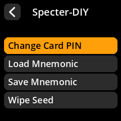

# Specter-DIY (MemoryCard)

The **Specter-DIY** applet (`SpecterDIY.cap`) is a small secure-element store that holds
a single BIP-39 mnemonic and protects it with a card PIN. SeedSigner can save a seed to
it, load it back, change its PIN, and wipe it.

See also: [Bundled JavaCard Applets](./javacard_applets.md).

## Requirements and setup

- The **Specter-DIY applet** flashed to a JavaCard (`SpecterDIY.cap`).
- **Smartcard support** enabled (default) and **Specter-DIY support** enabled in
  Settings → Advanced. **Specter-DIY support is disabled by default.**
- The `specter_card` Python module. If it is not installed globally, point SeedSigner at
  a checkout:

  ```bash
  export SEEDSIGNER_SPECTER_CARD_PY_PATH=/path/to/specter-javacard/py
  # or: export SEEDSIGNER_SPECTER_JAVACARD_PATH=...
  ```

## The Specter-DIY menu

**Tools → Smartcard Tools → Specter-DIY Functions**



| Menu item | What it does |
|---|---|
| **Change Card PIN** | Set or change the card's numeric PIN |
| **Load Mnemonic** | Read the stored mnemonic into SeedSigner |
| **Save Mnemonic** | Write the selected seed to the card |
| **Wipe Seed** | Erase the mnemonic from the card |

## Saving a mnemonic

1. Load the seed in SeedSigner.
2. **Specter-DIY Functions → Save Mnemonic**.
3. If the card has no PIN yet, SeedSigner offers to set one.
4. If the card already holds data, confirm the overwrite.

Only BIP-39 seeds can be stored (XPRV / Electrum / SLIP-39 seeds are rejected). The
mnemonic is stored as an encrypted blob.

## Loading a mnemonic

**Specter-DIY Functions → Load Mnemonic**. Enter the card PIN if required; SeedSigner
reads the mnemonic and loads it as a seed, then shows its fingerprint.

You can also reach the loader directly from **Seeds → Load a seed → From Specter-DIY**
(when Specter-DIY support is enabled).

## Changing the PIN

**Change Card PIN** handles all states:

- If the card reports its PIN is **disabled / not set**, you are prompted to set one.
- If a PIN is set, enter the old PIN and then the new one.
- If the PIN is **bricked** (all attempts used), the only recovery is to reinstall the
  Specter-DIY applet — there is no factory reset.

## Wiping the seed

**Wipe Seed** erases the stored mnemonic after a confirmation. It is not recoverable
unless you have another backup.

## Related

- [SeedKeeper](./seedkeeper.md)
- [Install applets on DIY JavaCards](./javacard_applets.md)
