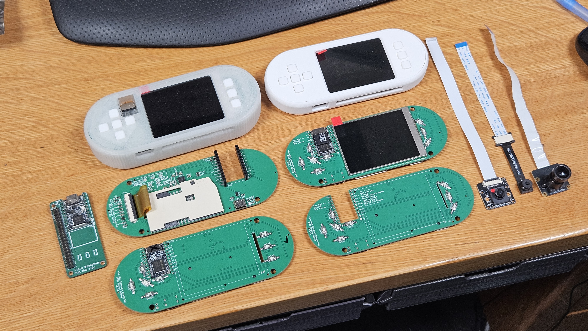

# SeedSigner-Plus Smartcard Pico

*Silkscreened as the **Pico-Mini Smartcard Display Hat** — v1.0.1, 2026, Stephen Rothery.*

A single-board SeedSigner carrier ("hat") for the **Luckfox Pico Mini**. It puts the display, joystick/buttons and a CCID/PCSC-compatible smart card interface on one board, so a self-contained SeedSigner + Satochip device can be built around a Pico Mini instead of a Raspberry Pi.

It is designed for this SeedSigner fork, which adds the smart card (Satochip / SeedKeeper) features: <https://github.com/3rdIteration/seedsigner>

## What's on the board

| Block | Part | Notes |
|-------|------|-------|
| Host module | Luckfox Pico Mini (Rockchip RV1106) | Plugs into the `LUCKFOX_PICO_MINI` footprint; MicroSD and USB-C are accessible from the board edge |
| Smart card controller | Microchip **SEC1210PV-URT** | Connected to the Pico Mini over UART; **SEC1210PV-UR2** is a drop-in alternative |
| Smart card socket | Amphenol **7312P0225A13LF** combo socket | One card channel (full-size smart card / SIM) |
| Display | Amphenol **62684-402100ALF** 40-pin 0.5 mm FPC | For a 2.8" SPI LCD; hard-wired for 4-line SPI (IM0=0, IM1=1, IM2=1) |
| Input | 8 × FSMSM tactile switches | 5-way joystick (up / down / left / right / press) plus Key1 / Key2 / Key3 |
| Power | USB-C power-only receptacle | ESD / TVS protected |

The camera is not routed on this board — it connects to the Pico Mini module directly.

## Configuration solder jumpers

Three pairs of jumpers let one board match either the on-board display or a Waveshare display hat. The factory default is marked `(*)` on the silkscreen. **Never bridge both options of a pair** (the board is silkscreened `NEVER BOTH`).

| Pair | Option A | Option B | Purpose |
|------|----------|----------|---------|
| JP201 / JP202 | `3v3` (*) | `MCU_BL` | LCD backlight: always-on 3v3, or PWM from the Pico Mini |
| JP203 / JP204 | `SPI_CS` (*) | `Backlight` | Pin 6 function |
| JP205 / JP206 | `MCU_CS` (*) | `GND` | Display chip-select connection |

SeedSigner currently does not use the backlight PWM and drives the display CS low all the time, so the defaults (backlight from 3v3, SPI CS driven from the Pico Mini) give the best compatibility. The full reasoning is in the schematic notes in `rpi_interface.kicad_sch`.

## Board and fabrication

- 2-layer PCB, 1.6 mm thickness, rounded handheld outline (approx. 138 mm × 52 mm).
- Fabrication files for JLCPCB are in [`jlcpcb/`](./jlcpcb/): Gerbers, BOM and CPL in `production_files/`, plus the individual Gerber exports in `gerber/`.
- KiCad project, created with KiCad 10. The schematic is split across the `rpi_interface`, `smartcard_reader`, `screen`, `buttons` and `Power` sheets.
- `Footprints/` and `Library.pretty/` hold the bundled project footprints/symbols; `fp-lib-table` and `sym-lib-table` point KiCad at them.

## Assembly notes

- The Pico Mini mounts **MicroSD side up**, with its USB-C end facing the board edge (see silkscreen).
- If you use a through-hole pin header instead of soldering the Pico Mini flat, tape over the pins — the LCD housing can otherwise short 3v3 to GND (silkscreen warning).

## Enclosure

3D-printable case files live in [`../../enclosures/luckfox_pico/plus-hat-smartcard-pico-zero/`](../../enclosures/luckfox_pico/plus-hat-smartcard-pico-zero/). The set covers both mounting options (soldered Pico Mini or through-hole pin header), matching microSD covers, a faceplate, and an optional camera cover:

| File | Purpose |
|------|---------|
| `SeedSigner Plus Pico Smartcard Case (BODY-Soldered).stl` | Main body for a soldered Pico Mini |
| `SeedSigner Plus Pico Smartcard Case (BODY-PINHEADER).stl` | Main body for a socketed pin-header Pico Mini |
| `SeedSigner Plus Pico Smartcard Case (Microsd cover soldered).stl` | microSD cover, soldered build |
| `SeedSigner Plus Pico Smartcard Case (MicroSD cover PINEHEADER).stl` | microSD cover, pin-header build |
| `SeedSigner Plus Pico Smartcard Case (Faceplate 1.0.1).stl` | Faceplate for this board revision |
| `SeedSigner Plus Pico Smartcard Case (Old Faceplate 1.0.0).stl` | Faceplate for the earlier board revision |
| `SeedSigner Plus Pico Smartcard Case (Optional small camera cover).stl` | Optional camera cover |

## Related hardware

- [`../SmartcardHat/`](../SmartcardHat/readme.md) — SEC1210 smart card hat for Raspberry Pi.
- [`../SeedSigner+ Smartcard combo hat/`](../SeedSigner+%20Smartcard%20combo%20hat/) — combined SeedSignerPlus display + smart card hat.
- Software support and wiring: [`../../docs/hardware_platform_support.md`](../../docs/hardware_platform_support.md) and [`../../docs/smartcard_support_installation.md`](../../docs/smartcard_support_installation.md).

## Changelog

**v1.0.1** — initial release of the Pico-Mini Smartcard Display Hat.
