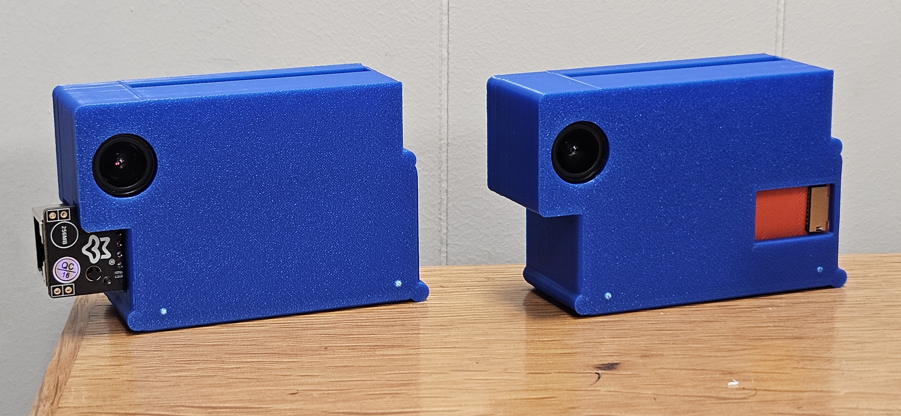
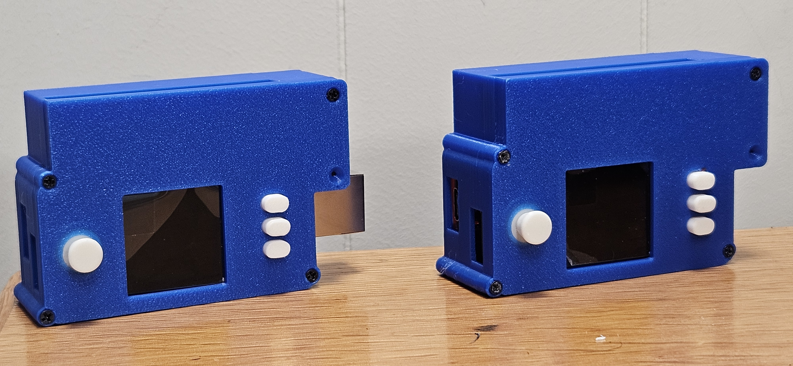

# Luckfox Pico Enclosures

There are two case variants here:

| Variant | Main Body STL |
|---------|---------------|
| Luckfox Pico Mini | `luckfox_pico_mini_mainbody.stl` |
| Luckfox Pico Pro/Max | `luckfox_pico_max_mainbody.stl` |

The case top (`luckfox_pico_common_casetop.stl`) is shared between both variants. The Pico Mini version also includes a microSD cover (`luckfox_pico_mini_micosd_cover.stl`).

## Source File

All STL files are derived from the included FreeCAD project file (`seedsigner-luckfox-pico-mini-v2-fullslot.FCStd`), created with FreeCAD 1.1.

## Hardware

- **4x M2-10mm screws** — secure the top to the main body
- **2x M3-5mm screws** — secure the adaptor PCB

## Related Components

- **Joystick** — uses the joystick faceplate from the [`common`](../common/Faceplate-Joystick/) enclosures folder
- **Buttons** — uses the buttons from the "OpenPill Mini with Coverplate" design
